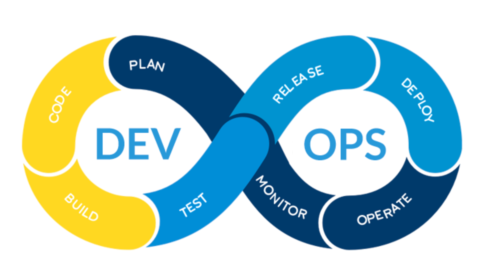
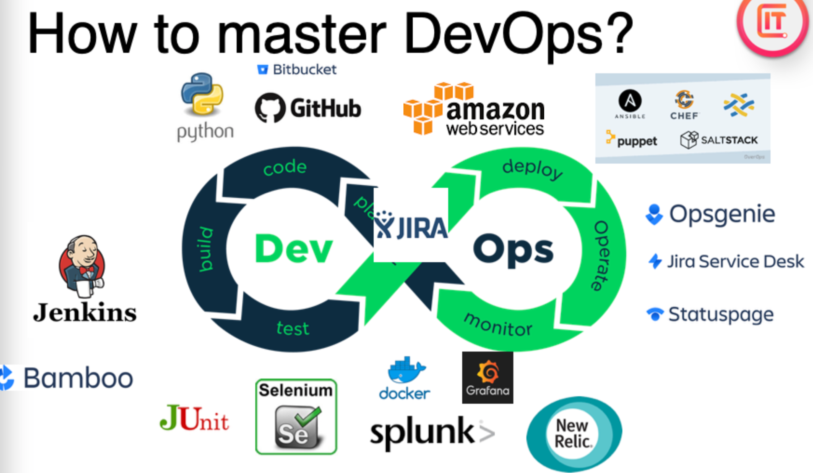

# 课堂笔记

## 1.课前小介绍
### Class Rules
- 尽量打开摄像头多互动，多问问题
- 多思考，总结不同工具，多做hands-on，记录自己的排错方法
- 每节课我们提供概念，基本实现步骤和实现后的结果
- 排错是你的任务，多google，多思考，90%的答案都在google上

DevOps是什么
DevOps是一组旨在保证高质量，高可用性的同时，减少软件迭代时间的开发， 测试与运维高度整合的实践。
- 历史上，开发(Dev)和运维(Ops)是分开的两个部分 。
- 就像Windows安装要等待很久，每次软件迭代需要等待很久，导致用户很不开心；同样的云端的软件，我们在迭代的同时，也不能系统宕机，怎么去完成这种更新，就需要我们的DevOps Process。
- 开发人员，就像造火车，对火车进行设计（开发）； DevOps等于造铁轨，同时监控火车有没有在铁轨上正常运行，上线过程中，需要CI/CD/Pipeline 测试，代码promotion，staging环境上的测试，以确保软件是否达到安全的级别，能不能很好的服务于用户；跑完测试，到部署环节，需要对网站后续健康状况进行监控。
 
整个课程就是围绕devops circle来讲，会着重介绍最重要的工具
 

How to master DevOps
首先要了解你们公司用的都是哪些工具
然后去研究这些工具的手册，也需要跟其他的工具做compare
- Senior level的 DevOps已经可以有能力给公司做一些tech stack方面的决定
- Junior/mid leve的 DevOps要能够看懂手册，把自动化的环节连在一块儿
会做Trouble shooting，解决工具使用中遇到的问题
Coding
- DevOps的coding主要是automation，就是把很多手动要做的东西做成自动化

DevOps路线图
 

