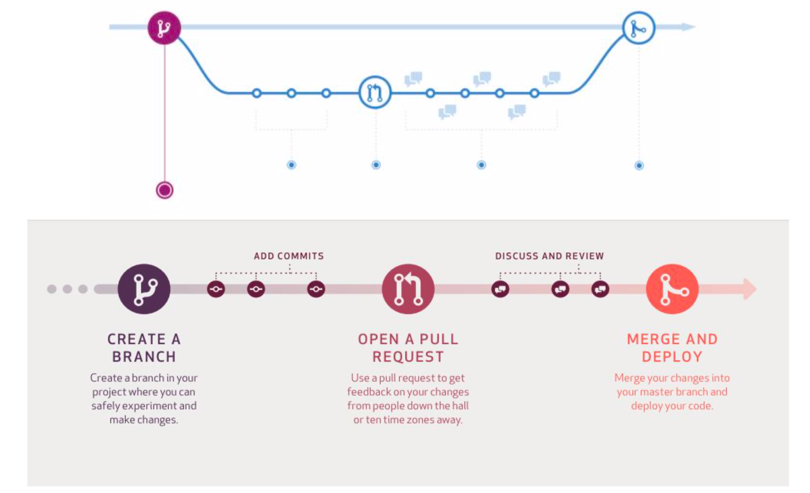

# 课堂笔记
## 1.背景介绍
### 自我介绍
Sean，Atlassian 的software developer，更多工作任务在于pipeline的维护  
从测试做起，转到developer，后面工作更偏运维
现在趋势是作为开发，你要懂运维；作为运维，你要懂开发；更强调全能型人才

Git Goal
在本地怎么工作的
在云端和远端存储，就要用到远端代码库/Github
解决文件版本控制中的conflict
创建自己的云端项目，并学会pull request


## 2.Background
### 2.1 What is a Version Control system? 
网站或者代码从开始，到产品上线，要经历不同的stage

到Candidate阶段，就已经接近或者可以ready for production了  
因此我们需要一个软件版本管理系统，可以来track这些不同的stage

A version control system, or VCS, is how one tracks changes, modifications, and updates to source files over time. Creating a history of changes for a project over time.

Used for:
• Documentation 
• Code
• Configuration
• Collaboration

#### 2.1.1 Version Control中的常见概念
- Repository（代码库）: Your project.
  - “I created a new repository (repo) for my school project so we can collaborate more easily.”
- Diff（两个文件间的差别）: The delta (additions and deletions) between two states of
a project.
- Commit: A snapshot of your project’s state at a point in
history. Records the difference between two points in history
with a diff.
- Branch: Modifications to a project (main branch = trunk) made
in parallel with the a main branch, but not affecting the main branch.
- Merge: Introducing changes from one branch into another.
- Clone: Downloading a local copy of a project.
- Fork（自动将代码库完全copy了一份，然后在copy的版本跟原版已经完全分离，例如app做andriod和ios双版本）: Your own version of somebody else’s project where you
take the original code-base and make modifications. May include many changes or just a few bug-fixes. Sometimes you end up merging those changes back upstream.
 
### 2.2 Types of Version Control system
- Centralised version control systems
  - 仍然有部分保密系数比较高的项目，考虑到代码的安全性，会选用这种系统
- Distributed version control systems

### 2.3 Why Use Git?
- Centralised cloud storage of your code. 
- Version Control.
- Working in teams. Code Review
- Get involved / Open Source.

### 2.4 Which Git to use? 
- Github vs Bitbucket
  - Bitbucket integrate well with Trello, Confluence and other DevOps software
  - Github has the largest market share.
    - 个人在Github可以多参加开源项目，增加经验
- 国内可以选码云https://gitee.com/
 

## 3.Step by step git hands-on
### 3.1 Git - Configuration 
```
    git config --list
    git config --global user.name "My Name"
    git config --global user.email "myself@gmail.com" 
    git config --global core.editor "nano"
```
### 3.2 Git - init
initializes a brand new Git repository and begins tracking an existing directory
```
    git init
```
### 3.3 Git - add
git本地端的流程一般如下

#### 3.3.1 Show command line manual
terminal下，使用`man`加命令，可以显示该命令的使用manual，如
```
    man touch
```
### 3.4 Stage a change
使用`git add`命令，来track 文件，如
```
    git add readme.md
```
### 3.5 Check staging status
使用`git status`来检查当前repo下，文件变更的信息
```
    git status
```
### 3.6 Add aliase
通过创建aliase来简化命令的输入，比如建立`status`的aliase
```
    git config --global alias.st status
```
### 3.7 Check "help"
在git任何命令后面跟`-h`，可以查到该命令的帮助，如
```
    git config -h
```
### 3.8 Git commit
saves the snapshot to the project history and completes the change-tracking process. In short, a commit functions like taking a photo.. Anything that’s been staged with git add will become a part of the snapshot with git commit
```
    git commit -m "wrote a readme file"
```
可以使用`-a`来commit所有变更的文件，如
```
    git commit -am "updated readme file"
```
如果需要更改最近一次commit的信息，可以使用`--amend`，如
```
    git commit --amend
```

### 3.9 Ignoring Files
Often, you’ll have a class of files that you don’t want Git to automatically add or even show you as being untracked. These are generally automatically generated files such as log files or files produced by your build system. In such cases, you can create a file listing patterns to match them named .gitignore
- A collection of .gitignore templates:
https://github.com/github/gitignore
 
### 3.10 Git log
查看commit history, 想要优化输出的结果，可以使用：
```
    git log --pretty=oneline
    git log --pretty=format:"%h %s" --graph
```
### 3.11 Git restore
将在working directory中的文件还原到未变更前，可以使用：
```
    git restore <file>
```
首先，文件变更指的是文件有改动，并且已经保存，`restore`无法还原任何未保存的变动，同时restore的情况基本发生在，该文件并未stage时（git add），一旦该文件被stage了，`restore`也无法还原变更。
  
### 3.12 Git reset/revert/rm/clean
reset:完全删掉某个commit之后的所有commit
revert:回滚到某个历史（commit）版本
rm:将文件从stage/tracking中移除
clean:将没有被tracking（没有commit到repository）的文件全部删除
详细使用命令也可参考：https://github.com/australiaitgroup/full-stack-bootcamp-wiki/blob/main/Class-05%20Git.md

### 3.13 Git stash
对尚未被stage/git add的文件，进行暂存操作：
`git stash`: 将文件暂存
`git stash list`: 查看stash里存在的文件
`git stash pop`或者`git stash apply [--index]`: 将stash里的文件，取出

### 3.14 课间练习：
https://github.com/JiangRenDevOps/DevOpsLectureNotesV4/blob/main/WK2-Git-Basics/git_basics.md

### 3.15 Git Cloud Repository：
将local连入云端，需要使用 git remote add, 例如
`git remote add origin https://github.com/australiaitgroup/DevOps-WIKI.git`
然后，就可以使用`git pull`与`git push`，同云端同步更新  
`commit` locally first, `push` later
`git push` updates the remote repository with any commits made locally to a branch.

### 3.15 Git Clone：
将云端的项目copy到本地，如
`git clone https://github.com/username/new_repo`
另外，
#### 3.15.1 How to create personal access token：
https://docs.github.com/en/free-pro-team@latest/github/authenticating-to-github/creating-a-personal-access-token

#### 3.15.2 Or use SSH：
https://docs.github.com/en/github/authenticating-to-github/connecting-to-github-with-ssh

### 3.16 Bitbucket Handson：
https://github.com/JiangRenDevOps/DevOpsLectureNotesV4/blob/main/WK2-Git-Basics/bb_basics.md

### 3.17 Git with branching：
- Create a branch (git branch)
  - 新branch的格式，可以是`feature/addFile`这样，前面声明是feature/bugfix或者其它
  - 使用`git checkout -b <branch name>`来创建一个新的branch
  - 对于本地新建的branch，更新到remote时，需要加入完整的参数，告之云端原本的branch为origin，例如  
   ```git push --set-upstream origin feat1```
- Checkout a branch (git checkout) 
  - 使用`git checkout <branch name>`来切换某个branch
- Merge a branch (git merge)
  - 使用`git merge`来合并分支，详细操作（包含conflict处理）可以 参阅：https://github.com/australiaitgroup/full-stack-bootcamp-wiki/blob/main/Class-05%20Git.md 
- Rebase a branch (git rebase)
  - merge等同于创建一个新的commit，然后将branch合并过来，而rebase就像嫁接，等于把新的branch直接接过来 
 
### 3.18 Pull Request：
Benefits:
- Peer Review
- Sufficient testing and better stability
- Reducing conflicts Continuous Delivery 
- Clearer responsibility
Before you create Pull Request, please check:
- Follow coding standard (code style, naming convention, etc. )
- Have tests
- No conflict
- DO NOT leave comment blank – add summary of this PR
Comments for Code Review:
- LGTM – look good to me 
- :+1
- Markdown  
 
一般一个pull request circle 如下


## 4.Visualisation


## 5.Summary
- Never forget .gitignore
- Fix conflicts before PR
- （尽量功能整合再push）Try to put all code for one function/subfunction/one bug fix in one git commit, which also means the commit should be small enough
- （确保自己的push没有任何小错误）Try to make sure every commit will not break the build pipeline, which means it should pass code style check and unit tests.
 