# Class-05 3.1 Devops
## 主要知识点
  - [1 Recap](#1-recap)
    - [1.1 software development life cycle](#11-software-development-life-cycle)
    - [1.2 SRE job responsibilities in software development life cycle](#12-sre-job-responsibilities-in-software-development-life-cycle)
    - [1.3 add a CNAME record for jiangren website](#13-add-a-cname-record-for-jiangren-website)
    - [1.4 problems happens without devops SRE](#14-problems-happens-without-devops-sre)
  - [2 What is Site Reliability Engineering?](#2-what-is-site-reliability-engineering)
    - [2.1 Dev and Ops](#21-dev-and-ops)
    - [2.2 Introduces changes of product](#22-introduces-changes-of-product)
    - [2.3 traditional Ops challenges](#23-traditional-ops-challenges)
    - [2.4 Devops](#24-devops)
  - [3 Staffing, Work, Ops Overload](#3-staffing-work-ops-overload)
    - [3.1 devops and develpers focus on different areas](#31-devops-and-develpers-focus-on-different-areas)
    - [3.2 devops and develpers corperation](#32-devops-and-develpers-corperation)
    - [3.3 Solution	to	conflict - DevOps/SRE](#33-solutiontoconflict---devopssre)
  - [4 Reliability](#4-reliability)
    - [4.1 SLI/SLO/SLA](#41-slislosla)
    - [4.2 Error budget](#42-error-budget)
  - [5 Minimise Damage](#5-minimise-damage)
  - [6 DevOps/SRE Practices](#6-devopssre-practices)
    - [6.1 Monitoring and logging](#61-monitoring-and-logging)
    - [6.2 On call / paging](#62-on-call--paging)
    - [6.4 Infrastructure as code / Model resources using code](#64-infrastructure-as-code--model-resources-using-code)
    - [6.5 Prevent recurrence](#65-prevent-recurrence)
  - [7 Tooling and Automation](#7-tooling-and-automation)
  - [8 Change Should Be Gradual](#8-change-should-be-gradual)
  - [9 The value of SRE](#9-the-value-of-sre)
  - [Group Exercise](#group-exercise)
  - [Reference:](#reference)

# 课堂笔记
## 1 Recap
### 1.1 software development life cycle

### 1.2 SRE job responsibilities in software development life cycle

### 1.3 add a CNAME record for jiangren website

### 1.4 problems happens without devops SRE
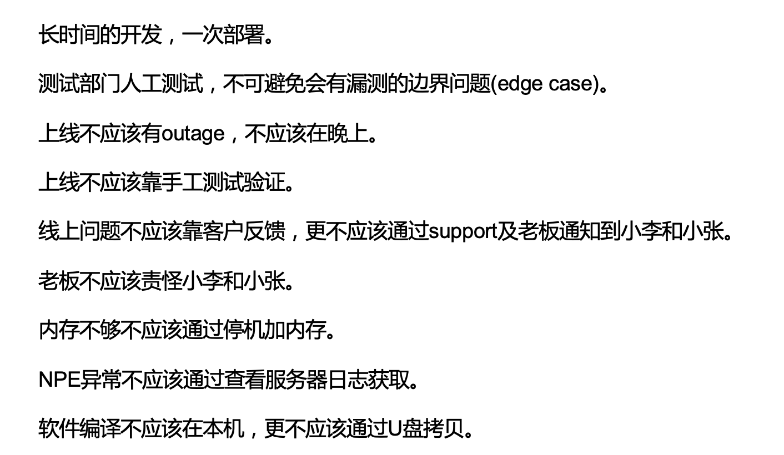
## 2 What is Site Reliability Engineering?

### 2.1 Dev and Ops
Dev wants to…
how quickly release new features
launch new features and see them adopted by users
“We want to launch anything, any time, without hindrance”

Ops wants to…
Maximise Stability (while they are holding the pager)  Keep current state
“We won’t want to ever change anything in the system once it works”

### 2.2 Introduces changes of product
- Release
- Hotfixes/rollbacks  
- Feature flags
- UI changes  
- Experiments
### 2.3 traditional Ops challenges
- Ops doesn’t know the code base has to keep it running
- Information asymmetry is extreme

### 2.4 Devops 
- DevOps简而言之就是使用软件开发(Dev)技术，来自动化Operation(Ops)的工作。这是一种工作文化上的转变，我们称此为DevOps文化。
- DevOps的目标是减短开发交付周期，并提高软件交付质量。
- 实例中传统问题的DevOps解决方案

- YOU BUILD IT YOU RUN IT

  “DevOps”⼈员构建PaaS平台，enable开发⼈员构建服务并轻松部署，为⾃⼰团队构 建的服务Oncall

- class SRE implements Devops
- 
  
  More proactive work and less reactive work.
  
  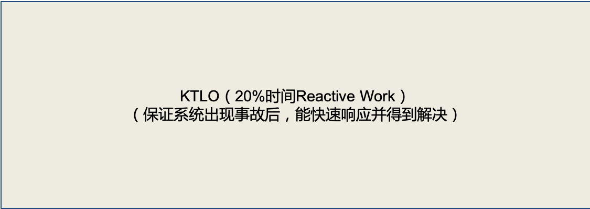
- Incident Management

  Detection -> Assessment -> Mitigation -> Post Mortem
  
## 3 Staffing, Work, Ops Overload
### 3.1 devops and develpers focus on different areas
  
  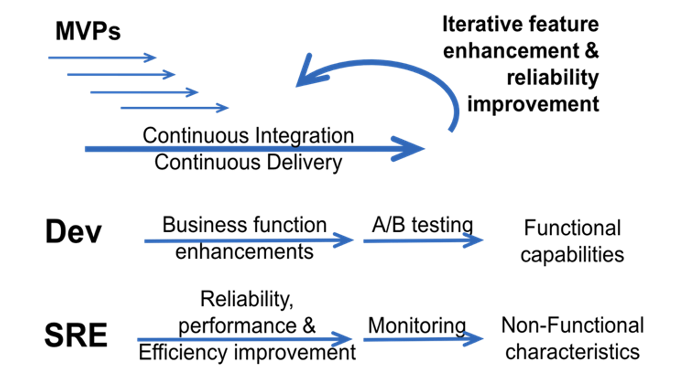
### 3.2 devops and develpers corperation
  - Common staff pooling
  - SRE hires coders  SRE Portability
  - Ensuring	a	Durable	Focus on Engineering
  - 50% Cap on Ops work
  - Pursuing	Maximum Change Velocity  Without Violating a Service’s SLO
  - DEV team sees production, rotate and corporate
### 3.3 Solution	to	conflict - DevOps/SRE
  - Embrace risks
  - Don’t avoid all outages - SLO/SLA
  - Set release policy
## 4 Reliability
### 4.1 SLI/SLO/SLA
  - Service Level	Indicators (SLI) - a carefully defined quantitative measure of some aspect of the level of service that is provided. 
  
    what does it consider about?
    
    1 request latency — how long it takes to return a response to a request-as a key SLI.
    
    2 error rate - often expressed as a fraction of all requests received
    
    3 system throughput - typically measured in requests per second
    
    4 availability - the fraction of the time that a service is usable
  - Service Level	Objectives (SLO) -  a target value or range of values for a service level that is measured by an SLI
     
     e.g. Uptime: percentage of time that a service is working and available  
    Latency: percentage of time of requests take less than X ms
  - Service Level Agreement (SLA) - Agreement between service provider and consumer
    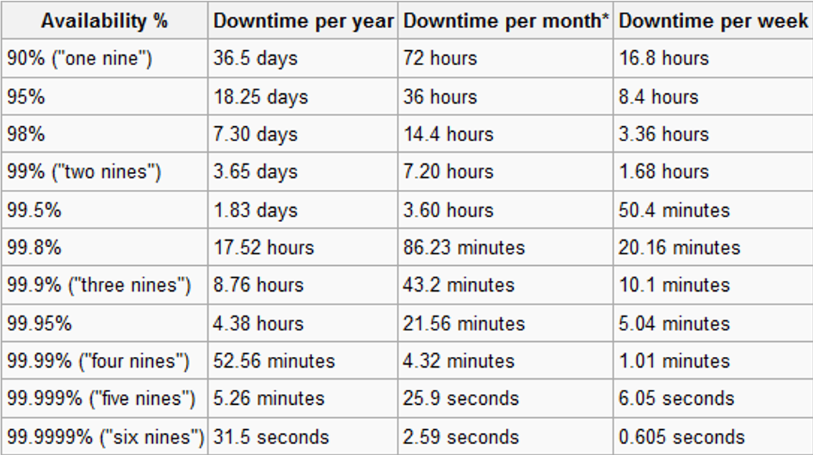
  - break down the webapp to multi-layers to measure
  
    1 Measure customer experience to understand SLO/SLIs for UIs

    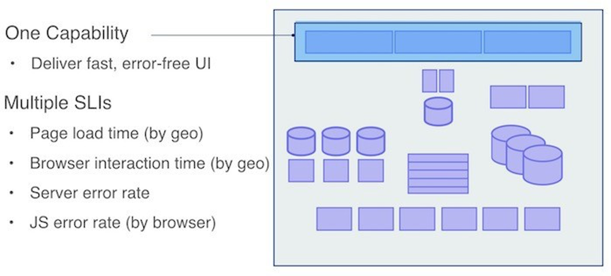

    2 Each logical	unit gets its own SLO

    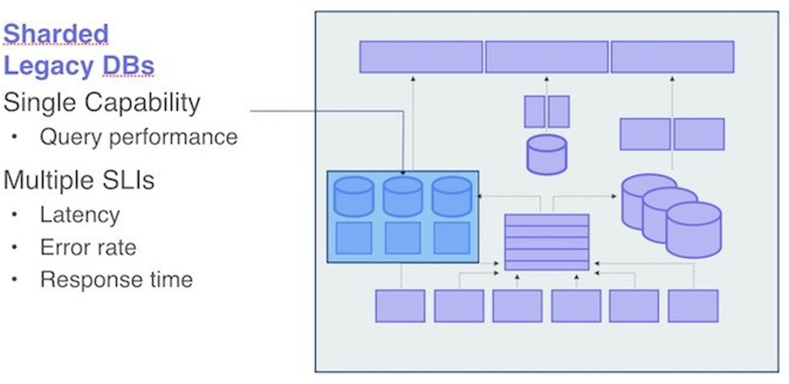

### 4.2 Error budget
- the base level errors effects more functions and cost more budget

  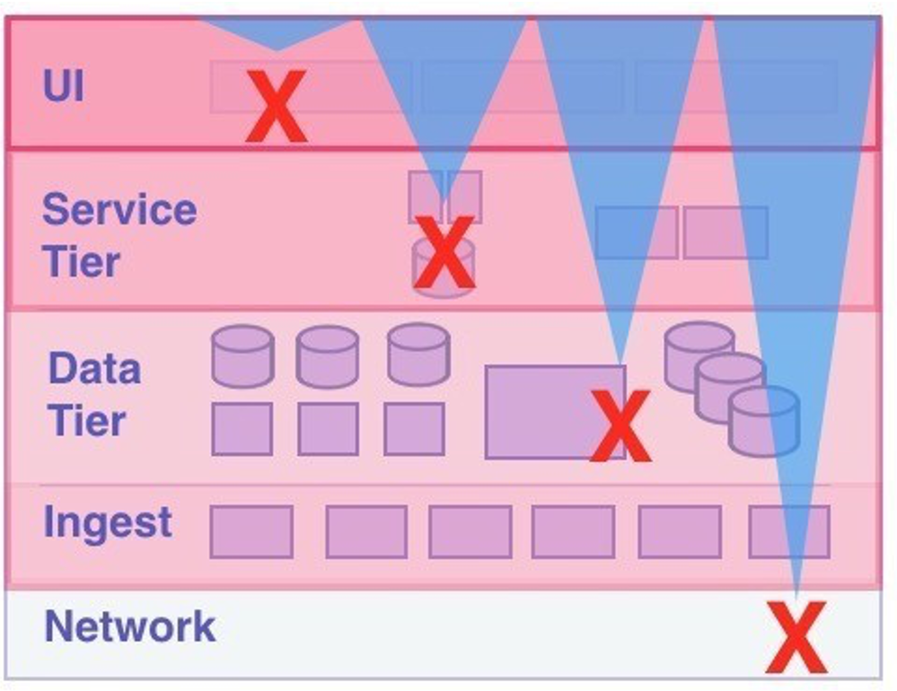
- How	to spend error budget?
  
  1 Within SLA, launch away

  2 Not within SLA, launch freeze
- Benefit of Error Budgets
  
  1 Removes main source of SRE-DEV conflict  DEV
  
  2 Teams self policing / enforcing
  
  3 Easy buy in from management
## 5 Minimise Damage
- Make outage as short as possible  
- Reduce MTTR - mean time to resolution
  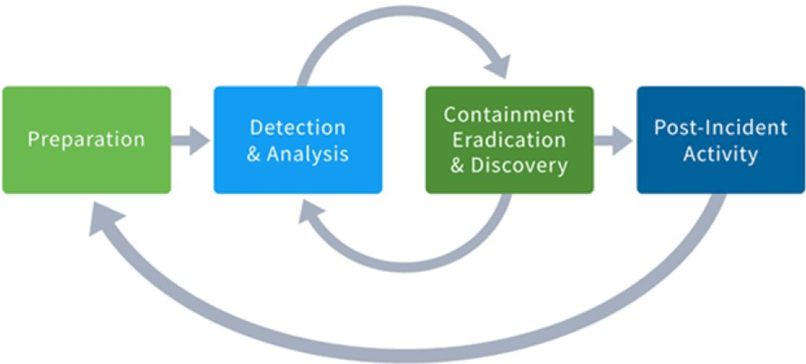
## 6 DevOps/SRE Practices
### 6.1 Monitoring and logging
### 6.2 On call / paging
  
### 6.4 Infrastructure as code / Model resources using code
  
### 6.5 Prevent recurrence
  - Handle the event  
  - Write post-mortem Reset
  - Post-mortem / Post incident review
      
      1 Blameless

      2 Focus on process and technology
      
      3 Create timeline
      
      4 Get all facts
      
      5 Create actionable improvement items

## 7 Tooling and Automation
- Work to	Minimize Toil
- Use the	Same Tooling, Regardless of  Function	or Job Title
- CI / CD pipeline
  
  Continuous Integration  Continuous Delivery & deployment
  
## 8 Change Should Be Gradual
- waterfall and agile approach
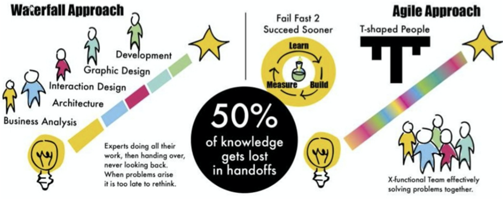
- Microservices  https://youtu.be/j1gU2oGFayY?t=33
  
  1 Monolith and Microservices
  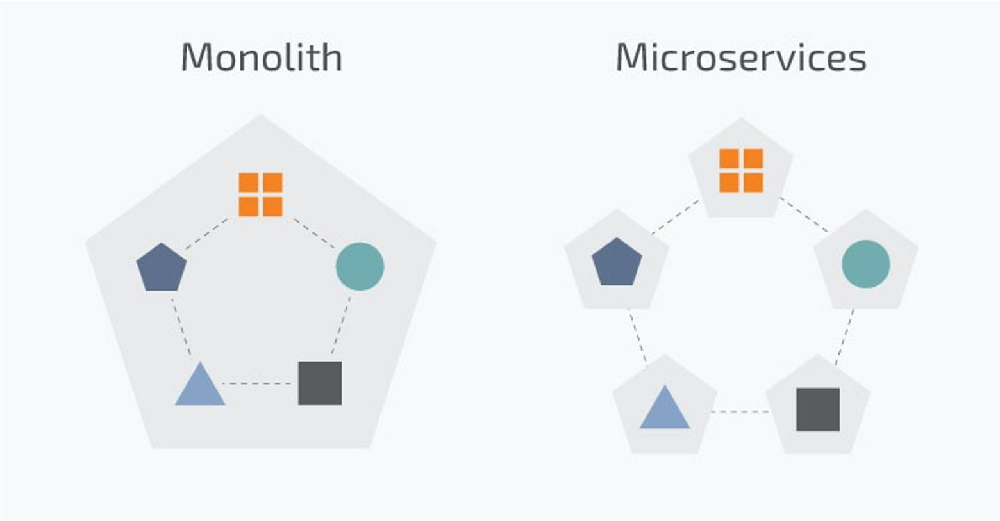

  2 Monolith problems
  

  3 Benifits of Microservices
  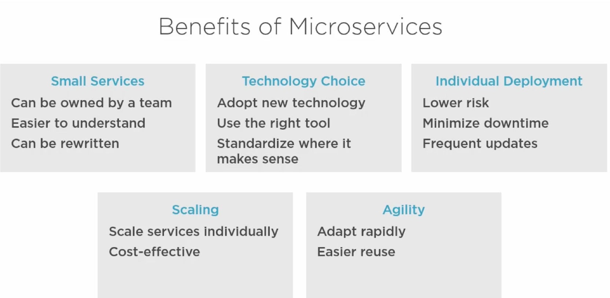

  4 Challenges of Microservices
  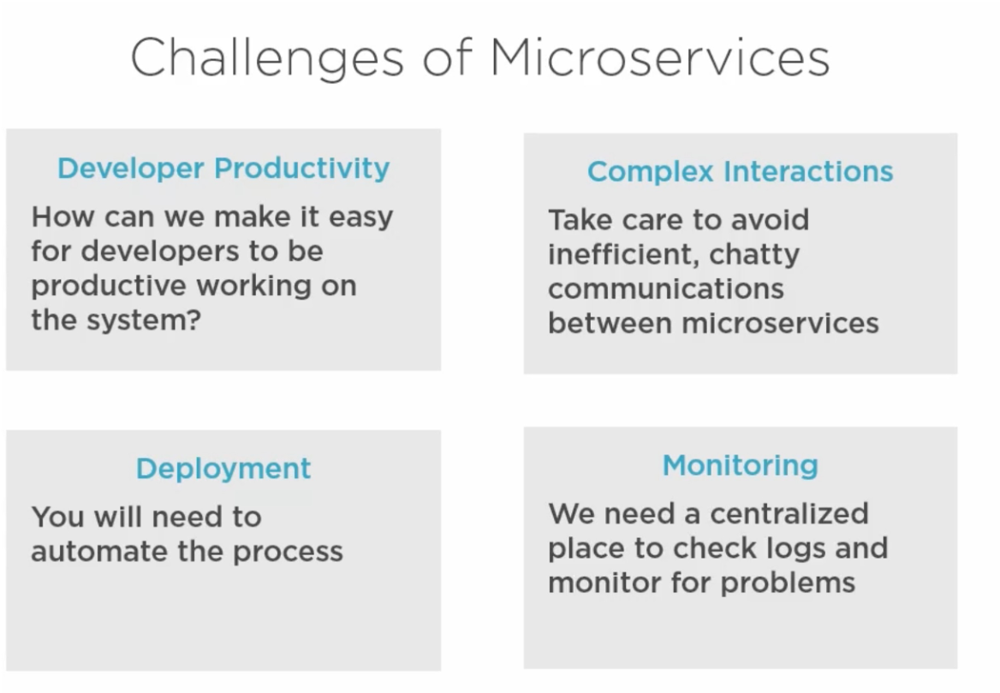

- Containerisation https://www.youtube.com/watch?v=n-JwAM6XF88

## 9 The value of SRE  
  - Alignment of development and operations through shared goals  Balance between functional and nonfunctional requirements
  - Separation of duties and compliance
  - Enhanced resource retention by making operations jobs attractive and    interesting  
  - Reduction incident impact
  - Faster rollout of version updates and bug fixes  Reduction of risk through automation

## Group Exercise
  
What happens when you enter google.com in your browser?

Or

What happens when you do curl google.com in your terminal?

  

## Homework
- Look for SRE positions requirements / Compare with current experiment / Identify gaps
- Complete a diagram of “what happens when you enter google.com into browser?”

## Reference:
Containerization:
https://www.youtube.com/watch?v=n-JwAM6XF88

blue green deployment:
https://blog.inedo.com/blue-green-deployment-best-practices

Atlassian Statuspage:
https://www.atlassian.com/software/statuspage

feature flags:
https://launchdarkly.com/blog/what-are-feature-flags/

feature-toggles - Martin Fowler:
https://martinfowler.com/articles/feature-toggles.html